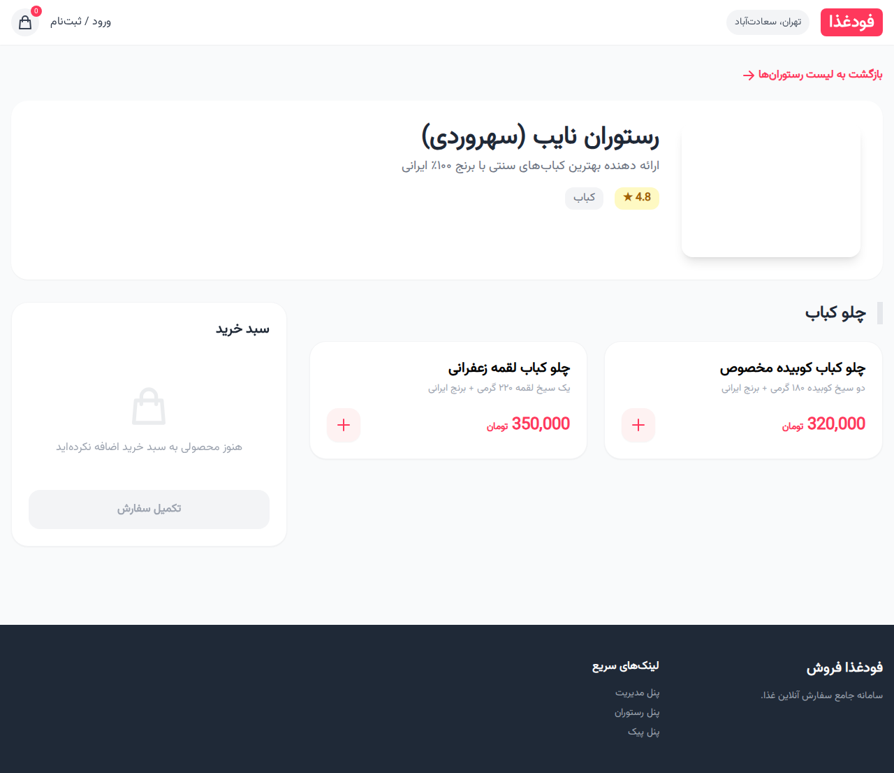

# فودغذا فروش (FoodGhaza Forosh) 🍔
**سامانه جامع سفارش آنلاین غذا مشابه تپسی‌فود**

این پروژه یک سامانه کامل سفارش آنلاین غذا است که شامل وب‌سایت فرانت‌اند (UI)، APIهای استاندارد (RESTful) و سیستم مدیریت نقش‌ها (RBAC) می‌باشد. این سامانه از ۴ نقش اصلی: **کاربر (مشتری)**، **صاحب رستوران**، **پیک (سفیر)** و **مدیر کل (Admin)** پشتیبانی می‌کند.

## ✨ ویژگی‌های کلیدی
- **طراحی مدرن و ریسپانسیو:** طراحی Mobile-First با استفاده از Tailwind CSS و فونت وزیر متن.
- **احراز هویت امن:** استفاده از JWT و شبیه‌سازی OTP.
- **مدیریت نقش‌ها (RBAC):** دسترسی‌های مجزا برای مشتری، رستوران، پیک و ادمین.
- **سیستم مالی:** کیف پول دیجیتال و مدیریت تراکنش‌ها و تسویه حساب‌ها.
- **مدیریت منو:** منوسازی پیشرفته برای رستوران‌ها.
- **پیگیری سفارش:** نمایش وضعیت زنده سفارش.

---

## 📸 گالری تصاویر (UI)

### ۱. صفحه اصلی و لیست رستوران‌ها


### ۲. جزئیات رستوران و منوی غذا


### ۳. پنل مدیریت کل (Admin Panel)


### ۴. پنل مدیریت رستوران (Vendor Panel)


### ۵. پنل سفیر و پیک (Courier Panel)


### ۶. ورود و احراز هویت


---

## 🛠 تکنولوژی‌های استفاده شده
- **Backend:** Node.js, Express.js
- **Database:** MongoDB, Mongoose
- **Security:** JWT, Helmet, Morgan, Bcrypt
- **Frontend:** HTML5, Tailwind CSS, JavaScript (Vanilla)
- **Fonts:** Vazirmatn (Local)

---

## 🚀 راه اندازی پروژه

### پیش‌نیازها
- Node.js (نسخه ۱۸ به بالا)
- MongoDB (در حال اجرا روی پورت ۲۷۰۱۷)

### نصب
۱. ابتدا وابستگی‌ها را نصب کنید:
```bash
npm install
```

۲. فایل `.env` را بر اساس نیاز خود تنظیم کنید:
```env
PORT=4000
MONGO_URI=mongodb://localhost:27017/food_order_api
JWT_SECRET=your_secret_key
```

۳. اجرای سرور:
```bash
npm start
```

۴. ورود به سامانه:
آدرس `http://localhost:4000` را در مرورگر باز کنید.

---

## 📝 مستندات API
برای مشاهده لیست کامل Endpointها و نحوه کار با API، به فایل [README_API.md](README_API.md) مراجعه کنید.

## 🗄 ساختار دیتابیس
جداول طراحی شده شامل:
- `Users`: اطلاعات کاربران و نقش‌ها
- `Restaurants`: مشخصات و وضعیت تایید رستوران‌ها
- `MenuItems`: منوی غذاها و قیمت‌ها
- `Orders`: ثبت و پیگیری سفارشات
- `Wallets & Transactions`: سیستم مالی و کیف پول
- `Coupons`: کدهای تخفیف و کمپین‌ها
- `Reviews`: نظرات و امتیازات کاربران

---
طراحی و پیاده‌سازی شده با ❤️ برای "فودغذا فروش"
