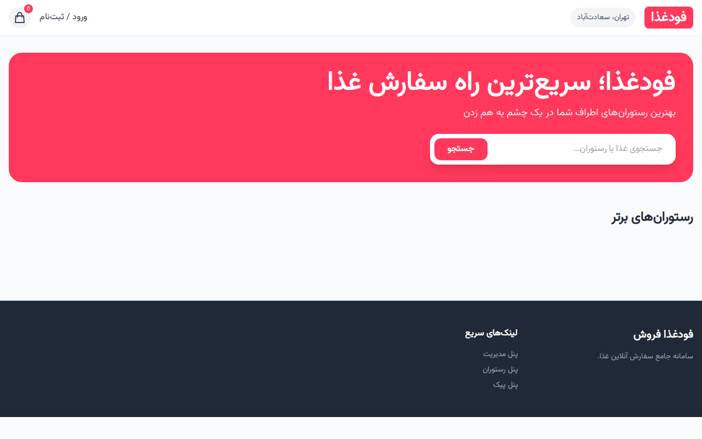
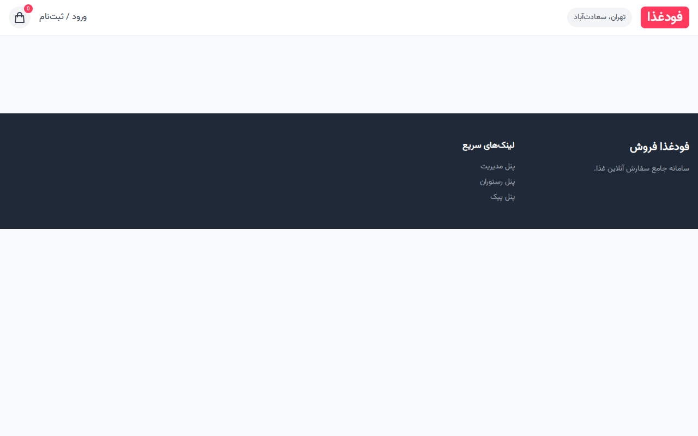
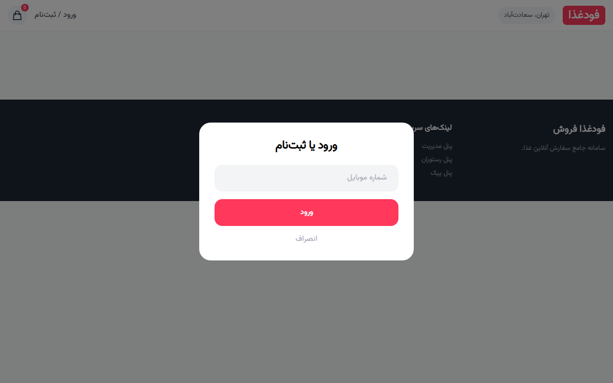
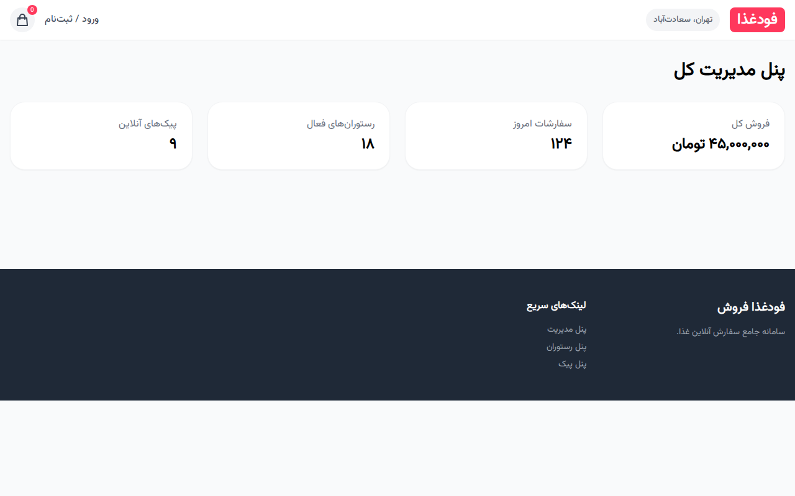
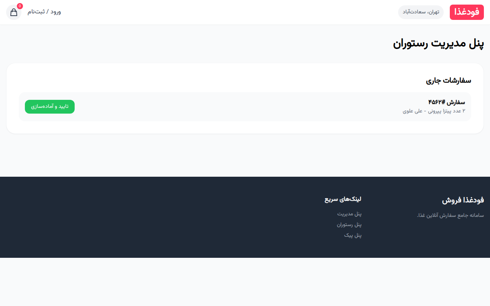
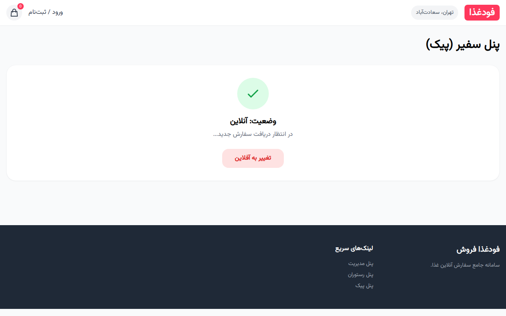

# فودغذا فروش (FoodGhaza Forosh)

سامانه جامع سفارش آنلاین غذا مشابه تپسی‌فود. این پروژه شامل وب‌سایت کامل، پنل‌های کاربری و APIهای استاندارد برای ۴ نقش اصلی (مشتری، صاحب رستوران، پیک و مدیر) است.

## ویژگی‌ها
- **بخش مشتریان:** احراز هویت OTP، جستجو و فیلتر پیشرفته، سبد خرید و پیگیری زنده سفارش.
- **بخش رستوران‌ها:** مدیریت منو، داشبورد سفارشات و کیف پول دیجیتال.
- **بخش پیک‌ها (سفیران):** مدیریت وضعیت (آنلاین/آفلاین)، دریافت سفارشات و گزارش درآمد.
- **پنل مدیریت کل:** آمار جامع، تایید هویت رستوران‌ها و مدیریت کمپین‌های تخفیف.

## تکنولوژی‌ها
- **Backend:** Node.js, Express, MongoDB (Mongoose)
- **Frontend:** HTML5, Tailwind CSS, Vanilla JS
- **Security:** JWT, Bcrypt, Helmet
- **Assets:** تمامی فونت‌ها (وزیر متن) و کتابخانه‌ها به صورت استاتیک و محلی استفاده شده‌اند.

## گالری تصاویر پروژه

### ۱. صفحه اصلی و لیست رستوران‌ها
نمای کلی وب‌سایت با قابلیت جستجو و دسته‌بندی رستوران‌ها.


### ۲. جزئیات رستوران و منو
نمایش منوی غذاها، قیمت‌ها و افزودن به سبد خرید.


### ۳. سیستم ورود و ثبت‌نام
احراز هویت پیامکی (شبیه‌سازی شده) با رابط کاربری مدرن.


### ۴. پنل مدیریت کل (Admin)
داشبورد آمار فروش، سفارشات و مدیریت سیستم.


### ۵. پنل صاحب رستوران (Vendor)
مدیریت سفارشات ورودی و وضعیت آماده‌سازی.


### ۶. پنل سفیران (Courier)
وضعیت فعالیت پیک و دریافت نوتیفیکیشن سفارش.


## راه اندازی سریع
۱. نصب وابستگی‌ها:
```bash
npm install
```
۲. تنظیمات `.env` (کپی از `.env.example`).
۳. اجرای داده‌های اولیه (Seed):
```bash
npm run seed
```
۴. اجرای پروژه:
```bash
npm start
```

---
طراحی و توسعه با رعایت اصول UI/UX مشابه تپسی‌فود.
